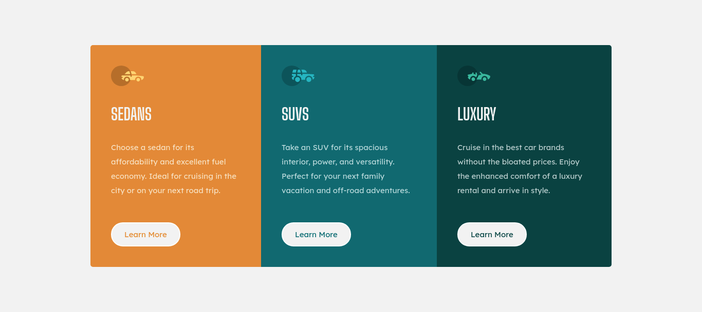

# Frontend Mentor - 3-column preview card component solution

This is a solution to the [3-column preview card component challenge on Frontend Mentor](https://www.frontendmentor.io/challenges/3column-preview-card-component-pH92eAR2-). Frontend Mentor challenges help you improve your coding skills by building realistic projects.

## Table of contents

- [Overview](#overview)
  - [The challenge](#the-challenge)
  - [Screenshot](#screenshot)
  - [Links](#links)
- [My process](#my-process)
  - [Built with](#built-with)
- [Author](#author)

## Overview

### The challenge

Users should be able to:

- View the optimal layout depending on their device's screen size
- See hover states for interactive elements

### Screenshot

### Links

- [Solution URL](https://www.frontendmentor.io/solutions/built-using-vuejs-XzAQIqzP9)
- [Live Site URL](https://3-column-preview-card-component-main-swart.vercel.app/)

## My process

### Built with

- Semantic HTML5 markup
- Flexbox
- Mobile-first workflow
- [Vue](https://vuejs.org/) - JS library

## Author

- Website - [Imad Atyat-Alah](https://imadatyatalah.vercel.app)
- Frontend Mentor - [@imadatyatalah](https://www.frontendmentor.io/profile/imadatyatalah)
- Twitter - [@imadatyatalah](https://www.twitter.com/ImadAtyat)
