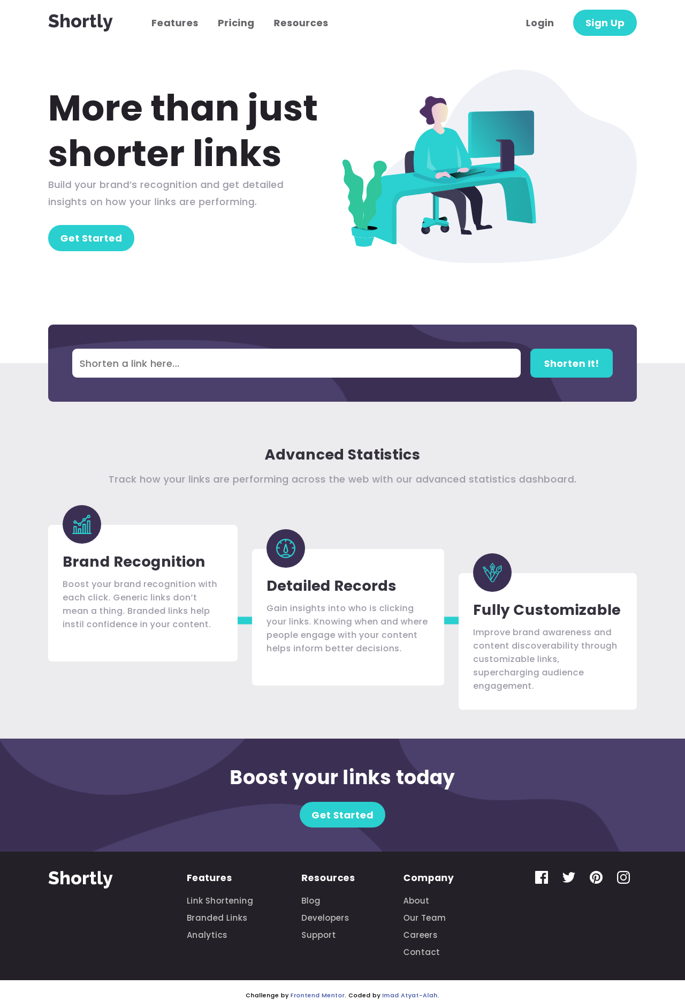

# Frontend Mentor - Shortly URL shortening API Challenge solution

This is a solution to the [Shortly URL shortening API Challenge challenge on Frontend Mentor](https://www.frontendmentor.io/challenges/url-shortening-api-landing-page-2ce3ob-G). Frontend Mentor challenges help you improve your coding skills by building realistic projects.

## Table of contents

- [Overview](#overview)
  - [The challenge](#the-challenge)
  - [Screenshot](#screenshot)
  - [Links](#links)
- [My process](#my-process)
  - [Built with](#built-with)
  - [What I learned](#what-i-learned)
  - [Useful resources](#useful-resources)
- [Author](#author)

## Overview

### The challenge

Users should be able to:

- View the optimal layout for the site depending on their device's screen size
- Shorten any valid URL
- See a list of their shortened links, even after refreshing the browser
- Copy the shortened link to their clipboard in a single click
- Receive an error message when the `form` is submitted if:
  - The `input` field is empty

### Screenshot

### Links

- Solution URL: [Add solution URL here](https://www.frontendmentor.io/solutions/built-using-nextjs-q3hMk_q3d)
- Live Site URL: [Add live site URL here](https://url-shortening-api-imadatyatalah.vercel.app/)

## My process

### Built with

- Semantic HTML5 markup
- Flexbox
- CSS Grid
- Mobile-first workflow
- [Next.js](https://nextjs.org/) - React framework
- [SASS](https://www.npmjs.com/package/sass) - For styles

### What I learned

I have learned a lot of stuff about styling with SASS!

### Useful resources

- [Structuring your Sass Projects](https://itnext.io/structuring-your-sass-projects-c8d41fa55ed4) - This helped me to structure my SASS files.

## Author

- Frontend Mentor - [@imadatyatalah](https://www.frontendmentor.io/profile/imadatyatalah)
- GitHub - [@imadatyatalah](https://www.github.com/imadatyatalah)
