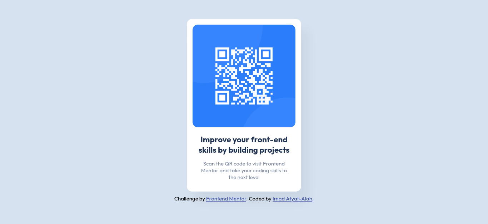

# Frontend Mentor - QR code component solution

This is a solution to the [QR code component challenge on Frontend Mentor](https://www.frontendmentor.io/challenges/qr-code-component-iux_sIO_H). Frontend Mentor challenges help you improve your coding skills by building realistic projects.

## Table of contents

- [Overview](#overview)
  - [Screenshot](#screenshot)
  - [Links](#links)
- [My process](#my-process)
  - [Built with](#built-with)
- [Author](#author)

## Overview

### Screenshot

### Links

- [Solution URL](https://www.frontendmentor.io/solutions/responsive-qr-code-component-using-flexbox-U_WS5Ig6R)
- [Live Site URL](https://qr-code-component-imadatyatalah.netlify.app/)

## My process

### Built with

- Semantic HTML5 markup
- CSS custom properties
- Flexbox
- Mobile-first workflow

## Author

- Website - [Imad Atyat-Alah](https://imadatyatalah.vercel.app)
- Frontend Mentor - [@imadatyatalah](https://www.frontendmentor.io/profile/imadatyatalah)
- Twitter - [@imadatyatalah](https://www.twitter.com/ImadAtyat)
