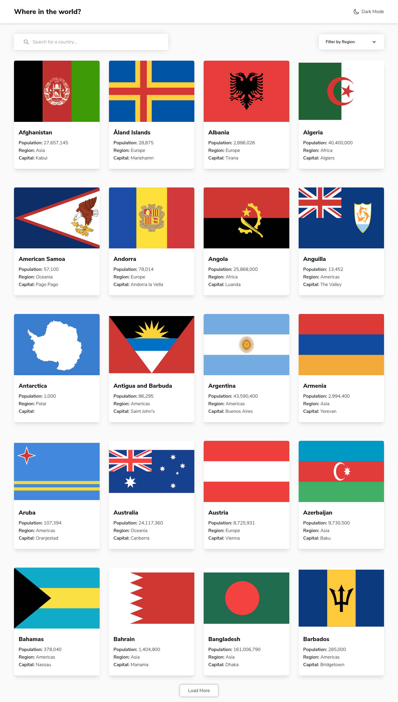

# Frontend Mentor - REST Countries API with color theme switcher solution

This is a solution to the [REST Countries API with color theme switcher challenge on Frontend Mentor](https://www.frontendmentor.io/challenges/rest-countries-api-with-color-theme-switcher-5cacc469fec04111f7b848ca). Frontend Mentor challenges help you improve your coding skills by building realistic projects.

## Table of contents

- [Overview](#overview)
  - [The challenge](#the-challenge)
  - [Screenshot](#screenshot)
  - [Links](#links)
- [My process](#my-process)
  - [Built with](#built-with)
  - [What I learned](#what-i-learned)
- [Author](#author)

## Overview

### The challenge

Users should be able to:

- See all countries from the API on the homepage
- Search for a country using an `input` field
- Filter countries by region
- Click on a country to see more detailed information on a separate page
- Click through to the border countries on the detail page
- Toggle the color scheme between light and dark mode _(optional)_

### Screenshot



### Links

- [Solution URL](https://www.frontendmentor.io/solutions/built-using-nextjs-and-styled-with-tailwindcss-vfgAMHP_Z)
- [Live Site URL](https://rest-countries-api-with-color-theme-switcher-nine.vercel.app/)

## My process

### Built with

- Flexbox
- CSS Grid
- Mobile-first workflow
- [SWR](https://swr.vercel.app/) - For fetching & caching data
- [React](https://reactjs.org/) - JS library
- [Next.js](https://nextjs.org/) - React framework
- [TailwindCSS](https://tailwindcss.com/) - For styles

### What I learned

I have learned more about useMemo hook.

```jsx
const filteredData = useMemo(() => {
  if (region) {
    return data.filter((country) => country.region === region);
  }

  if (searchValue) {
    return data.filter((country) =>
      country.name.toLowerCase().includes(searchValue.toLowerCase())
    );
  }

  return data;
}, [data, region, searchValue]);
```

## Author

<!-- - Website - [Add your name here](https://www.your-site.com) -->

- Frontend Mentor - [@imadatyatalah](https://www.frontendmentor.io/profile/imadatyatalah)
- GitHub - [@imadatyatalah](https://github.com/imadatyatalah)
