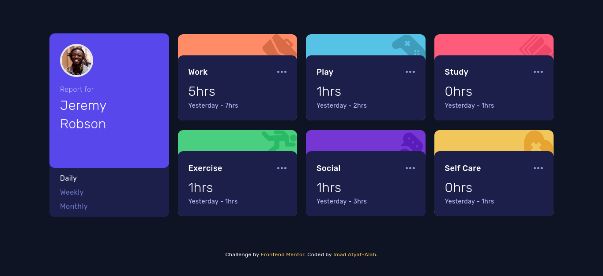

# Frontend Mentor - Time tracking dashboard solution

This is a solution to the [Time tracking dashboard challenge on Frontend Mentor](https://www.frontendmentor.io/challenges/time-tracking-dashboard-UIQ7167Jw). Frontend Mentor challenges help you improve your coding skills by building realistic projects.

## Table of contents

- [Overview](#overview)
  - [The challenge](#the-challenge)
  - [Screenshot](#screenshot)
  - [Links](#links)
- [My process](#my-process)
  - [Built with](#built-with)
  - [What I learned](#what-i-learned)
  - [Useful resources](#useful-resources)
- [Author](#author)

## Overview

### The challenge

Users should be able to:

- View the optimal layout for the site depending on their device's screen size
- See hover states for all interactive elements on the page
- Switch between viewing Daily, Weekly, and Monthly stats

### Screenshot

### Links

- [Solution URL](https://your-solution-url.com)
- [Live Site URL](https://your-live-site-url.com)

## My process

### Built with

- Semantic HTML5 markup
- CSS custom properties
- Flexbox
- CSS Grid
- Mobile-first workflow
- [React](https://reactjs.org/) - JS library
- [Vite.js](https://vitejs.dev/) - Next generation frontend tooling. It's fast!
- [TailwindCSS](https://tailwindcss.com/) - For styles

### What I learned

Finally I got the chance to try [Vite.js](https://vitejs.dev/) and learn about it!

It's so fast⚡️!

### Useful resources

- [Vite.js](https://vitejs.dev/) - The only place that you need to learn Vite.js.

## Author

- Frontend Mentor - [@imadatyatalah](https://www.frontendmentor.io/profile/imadatyatalah)
- GitHub - [@imadatyatalah](https://www.github.com/imadatyatalah)
